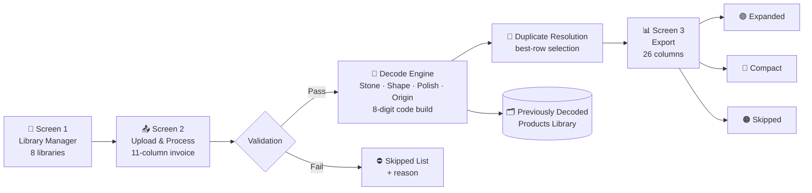

<div align="center">

# 🔷 Customised Product Spec Decoder

### Turn messy customer invoice sheets into clean, ERP-ready product templates.

**Built for ORAVA (Pvt) Ltd** — decodes customised gemstone orders into standardized 8-digit product codes for Odoo import.


</div>

---

## 📸 Screenshot

<div align="center">

<!-- 👇 Replace this with your actual screenshot — drag & drop the image into this spot on GitHub, or commit it to /docs/screenshot.png and keep the path below -->


*Paste or drag your app screenshot here*

</div>

---

## 🧭 Overview

**Customised Product Spec Decoder** is a Windows desktop application (Python + Tkinter) that reads raw customer order/invoice spreadsheets and converts each line item into a fully-structured, individual product entry ready for ERP import — matching stone, shape, and polish type against curated lookup libraries, resolving duplicates intelligently, and exporting clean, styled Excel files.

Unlike ORAVA's other SSKU-decoding tools, every product here is treated as **unique and individual** — no grouping, no comma-separated variant values. One invoice row in → one fully-decoded product out.

> 🏢 **Company:** ORAVA (Pvt) Ltd &nbsp;·&nbsp; 👨‍💻 **Developer:** Shehan Nirmana &nbsp;·&nbsp; 🗂️ **Exe:** `Customised_Product_Spec_Decoder.exe`

---

## ✨ Key Features

| | |
|---|---|
| 🧬 **8-Digit Product Coding** | `F` + 4-digit stone + 1-char polish + 2-digit shape |
| 🔍 **8-Level Polish Matching** | Priority cascade across Shape / Ref.No / Plan No. / Remarks |
| 🧩 **Smart Duplicate Resolution** | Groups by product key, keeps the most complete row, merges LAB certs |
| 🏷️ **Project-Aware Referencing** | Special handling for 6 named projects sharing a Ref.No |
| 🚫 **Auto-Skip Guardrails** | Mixed/MX/FS sizes, blank shapes, and "Metal" variety rows are filtered out |
| 📚 **8 Editable Libraries** | Stone, Shape (short + full-name), Polish Type, Origin, Category, Colour, Decoded History |
| 📤 **Triple Export Modes** | Expanded, Compact, and Skipped — all styled, all traceable |
| 🧾 **Full Traceability** | Every export row keeps its upload filename + row number |
| 🗃️ **Self-Learning Memory** | Auto-saves decoded products so re-uploads skip already-processed rows |

---

## 🖥️ Tech Stack

```
Language        Python 3.14
GUI             tkinter + ttk (custom RoundButton widgets, scrollable Treeview)
Spreadsheets    openpyxl (write-only streaming mode for large exports)
Imaging         Pillow (logo processing, LANCZOS resize)
Packaging       PyInstaller (--onefile --windowed)
Storage         JSON (app_data/, persisted next to the .exe)
```

---

## 🗺️ Application Flow



---

## 📚 Libraries (Screen 1)

| # | Library | Purpose | Approx. Entries |
|---|---|---|---|
| 1 | Stone Name | Code → Stone name (letters-only matching) | ~115 |
| 2 | Shape – 2 Digit | Shape code → Name + Size Type (L&W / D&H) | ~53 |
| 3 | Full Name Shape | Long/variant shape names → 2-digit code | ~21 |
| 4 | Polish Type Lookup | Shape/Ref.No/Plan No./Remarks → Polish Type | ~1,126 |
| 5 | Origin | Code or full name → Origin name | ~23+ |
| 6 | Category Name | Stone → "All/ Stones/ Finish / Stone Name" | — |
| 7 | Colour | Stone → Colour (reference only, not used in decode) | — |
| 8 | Previously Decoded Products | Auto-saved decode history, searchable | Grows over time |

---

## 📦 Export Format (Screen 3 — 26 Columns)

<details>
<summary><b>Click to expand full column list</b></summary>

| Col | Field | Col | Field |
|---|---|---|---|
| 1 | Internal Reference | 14 | Tracking |
| 2 | Name (8-digit) | 15 | Sales Price |
| 3 | Product Category | 16 | Sales Taxes |
| 4 | Tags | 17 | Cost |
| 5 | Unit | 18 | Purchase Taxes |
| 6 | Attribute | 19 | Company |
| 7 | Values | 20 | SSKU with Size |
| 8 | Sales | 21 | Plan No. |
| 9 | Purchase | 22 | Remarks |
| 10 | Product Type | 23 | LAB Certification |
| 11 | Invoicing Policy | 24 | Origin |
| 12 | Control Policy | 25 | Upload Ref Sheet Name |
| 13 | Inventory tracking | 26 | Upload Ref Sheet Raw No. |

</details>

**Three export buttons:** 🟢 Expanded &nbsp;·&nbsp; 🔵 Compact &nbsp;·&nbsp; 🟠 Skipped

---

## 🚀 Getting Started

### Run from source

```bash
git clone https://github.com/<your-username>/customised-product-spec-decoder.git
cd customised-product-spec-decoder
pip install -r requirements.txt
python main.py
```

### Build the standalone .exe

```bash
pyinstaller --onefile --windowed --icon=icon.ico \
  --add-data "logo.png;." --add-data "icon.ico;." \
  --name "Customised_Product_Spec_Decoder" main.py
```

The built executable will appear in `dist/Customised_Product_Spec_Decoder.exe`.

---

## 📁 Project Structure

```
customised_product_spec_decoder/
├── main.py                          # Application source
├── logo.png                         # Company logo (1200×424)
├── icon.ico                         # Window/exe icon
├── requirements.txt                 # Python dependencies
├── Customised_Product_Spec_Decoder.spec   # PyInstaller build spec
├── CLAUDE_CODE_INSTRUCTIONS.md      # Full technical specification
├── PROJECT_STATUS.md                # Edit history & versioning log
└── app_data/                        # Auto-created — JSON library storage
    ├── stone_library.json
    ├── shape_library.json
    ├── fullname_shape_library.json
    ├── polish_type_library.json
    ├── origin_library.json
    ├── category_library.json
    ├── colour_library.json
    └── decoded_products_library.json
```

---

## 🕒 Version History

| Version | Highlights |
|---|---|
| **v1.3** | Major rewrite — individual products, 8-digit `F`-prefixed code, 3 screens, project-based duplicate resolution |
| v1.2 | Added LAB Certification & Origin traceability columns |
| v1.1 | 2-decimal size formatting, floor-based SSKU ranges, upload traceability columns |
| v1.0 | Initial release — 4 screens, 8 libraries, full decode pipeline |

Full detailed changelog: see [`PROJECT_STATUS.md`](./PROJECT_STATUS.md)

---

<div align="center">

**ORAVA (Pvt) Ltd** &nbsp;|&nbsp; Developed by **Shehan Nirmana** &nbsp;|&nbsp; v1.3 — 2026

</div>
